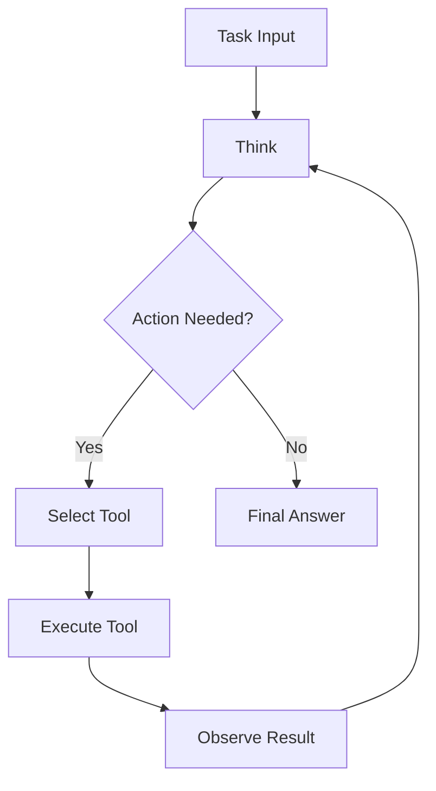

# ReActLib

> Reason + Act pattern implementation for building step-by-step AI agents

[](https://github.com/MukundaKatta/ReActLib/actions)
[](LICENSE)
[]()

## What is ReActLib?

ReActLib implements the ReAct (Reasoning + Acting) pattern for AI agents. It provides a framework where agents think step-by-step, choose actions from a tool registry, observe results, and iterate until a task is complete. Works with any LLM backend or even rule-based reasoning.

## Features

- ReAct loop with configurable max steps
- Tool registry with dynamic tool registration
- Structured thought/action/observation traces
- Built-in tools: calculator, search simulator, text processor
- Async-ready execution
- Full execution trace for debugging

## Quick Start

```bash
pip install reactlib
```

```python
from reactlib import ReActAgent, Tool, ToolRegistry

# Define tools
def calculator(expression: str) -> str:
    try:
        return str(eval(expression, {"__builtins__": {}}, {}))
    except Exception as e:
        return f"Error: {e}"

registry = ToolRegistry()
registry.register(Tool(name="calc", description="Evaluate math", execute=calculator))

# Create agent with a simple reasoning function
agent = ReActAgent(tools=registry)
trace = agent.run("What is 25 * 4 + 10?")
print(trace.final_answer)
```

## Architecture



## Inspired By

This project was inspired by the [ReAct paper](https://arxiv.org/abs/2210.03629) and modern agent frameworks like LangChain agents, but takes a simpler, dependency-light approach.

---

**Built by [Officethree Technologies](https://github.com/MukundaKatta)** | Made with love and AI
